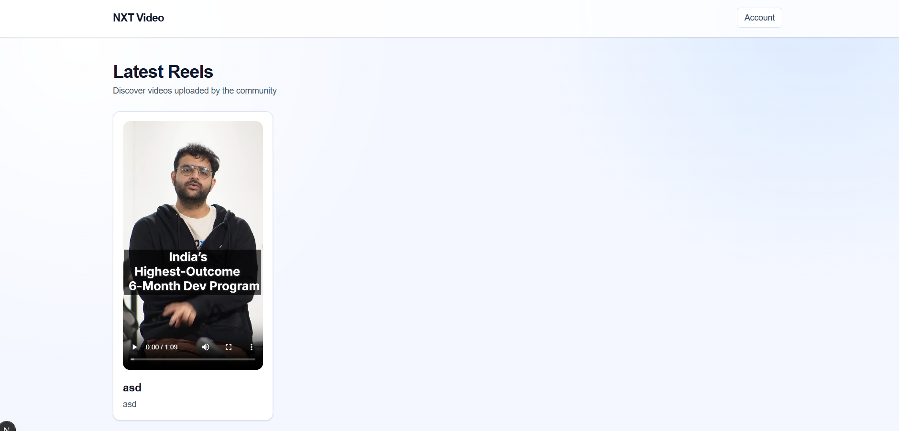

# NXT Video

A modern short-video platform built with Next.js App Router, MongoDB, NextAuth, and ImageKit.



> Dashboard preview from the live app UI.

## What It Does

NXT Video lets users:
- Register and log in (credentials + optional OAuth providers)
- Upload short videos and thumbnails via ImageKit
- Store video metadata in MongoDB
- Browse a feed of videos
- Open a dedicated details page for each video

## Tech Stack

- Next.js 15 (App Router)
- React 19
- TypeScript
- NextAuth
- MongoDB + Mongoose
- ImageKit (`@imagekit/next`)
- Tailwind CSS 4

## Architecture Overview

The app uses server-rendered pages for data-heavy routes and client components for interactivity.

```mermaid
flowchart LR
  U[User Browser] --> APP[Next.js App Router]
  APP --> AUTH[NextAuth]
  APP --> API[/app/api/video]
  APP --> IKAPI[/app/api/auth/imagekit-auth]
  AUTH --> DB[(MongoDB)]
  API --> DB
  IKAPI --> IK[ImageKit Auth Signature]
  U --> IKUP[ImageKit Upload]
  IKUP --> APP
```

## Request Flow

### 1. Feed (`/`)
1. Server page fetches videos from MongoDB.
2. Videos are rendered as cards with title, description, and video player.

### 2. Upload (`/upload`)
1. User uploads video + thumbnail in client form.
2. Client requests ImageKit auth signature from `/api/auth/imagekit-auth`.
3. Files upload directly to ImageKit.
4. Client posts metadata to `/api/video`.
5. API persists video document in MongoDB.

### 3. Video Details (`/videos/[id]`)
1. Dynamic route validates ObjectId.
2. Server fetches single video from MongoDB.
3. Page renders player + full details.

## Project Structure

```txt
app/
  api/
    auth/
      [...nextauth]/route.ts
      imagekit-auth/route.ts
      register/route.ts
    video/route.ts
  components/
    Header.tsx
    Notification.tsx
    Providers.tsx
    VideoComponent.tsx
    VideoFeed.tsx
    VideoUploadForm.tsx
    fileUpload.tsx
  videos/[id]/page.tsx
  login/page.tsx
  register/page.tsx
  upload/page.tsx
  page.tsx
lib/
  auth.ts
  db.ts
models/
  User.ts
  Video.ts
```

## Environment Variables

Create `.env` from `.env.example`:

```env
MONGODB_URI=mongodb://127.0.0.1:27017/imagekit
NEXTAUTH_SECRET=your_random_secret
NEXTAUTH_URL=http://localhost:3000

NEXT_PUBLIC_PUBLIC_KEY=public_xxxxx
NEXT_PUBLIC_URL_ENDPOINT=https://ik.imagekit.io/your_imagekit_id
IMAGEKIT_PRIVATE_KEY=private_xxxxx

# optional
# GOOGLE_CLIENT_ID=
# GOOGLE_CLIENT_SECRET=
# GITHUB_ID=
# GITHUB_SECRET=
```

## Run Locally

```bash
npm install
npm run dev
```

App runs at `http://localhost:3000`.

## Build & Checks

```bash
npm run lint
npm run build
```

## API Routes

- `POST /api/auth/register` -> create new user
- `GET /api/auth/imagekit-auth` -> generate ImageKit upload auth params
- `GET /api/video` -> list videos
- `POST /api/video` -> create video (authenticated)
- `GET|POST /api/auth/[...nextauth]` -> NextAuth handlers

## Notes

- Feed and video details are configured as dynamic server routes.
- Image upload and video upload are direct-to-ImageKit for performance.
- Notification context provides lightweight in-app feedback to users.

